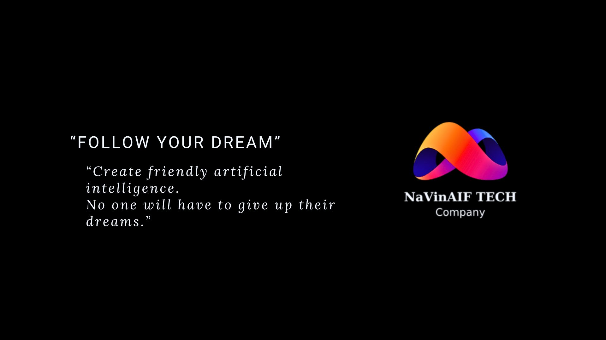
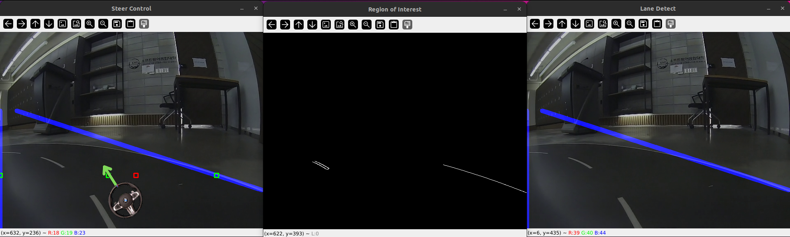
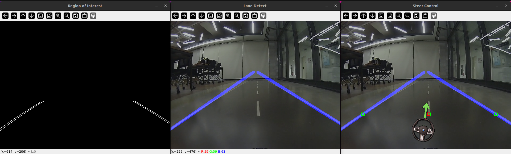
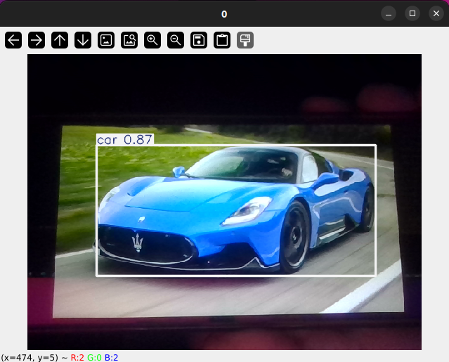
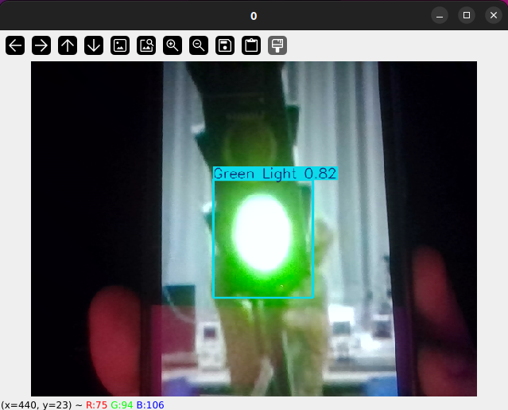
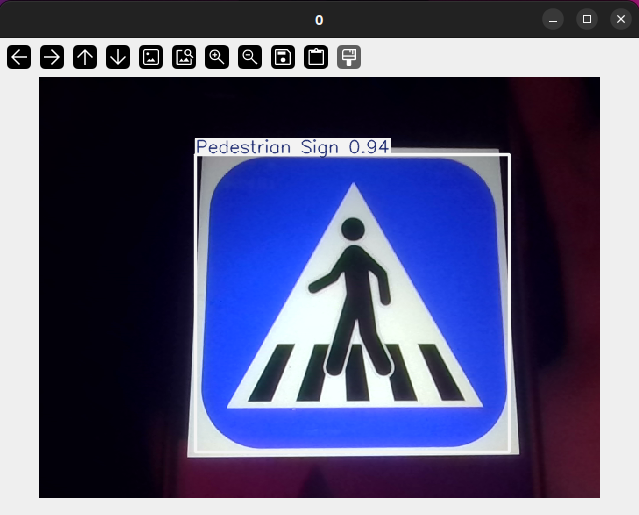
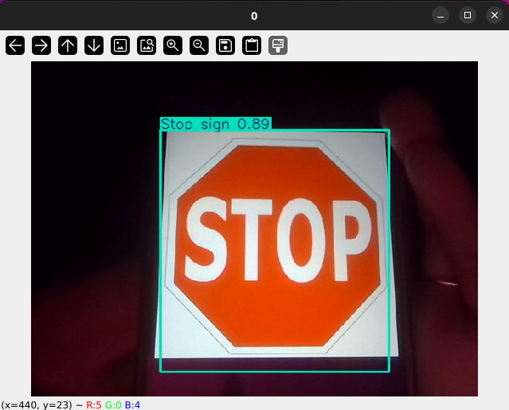
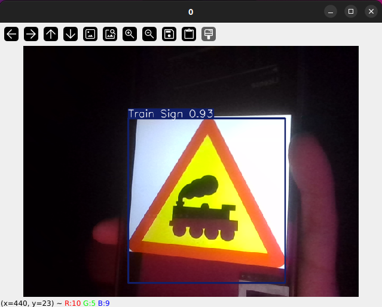
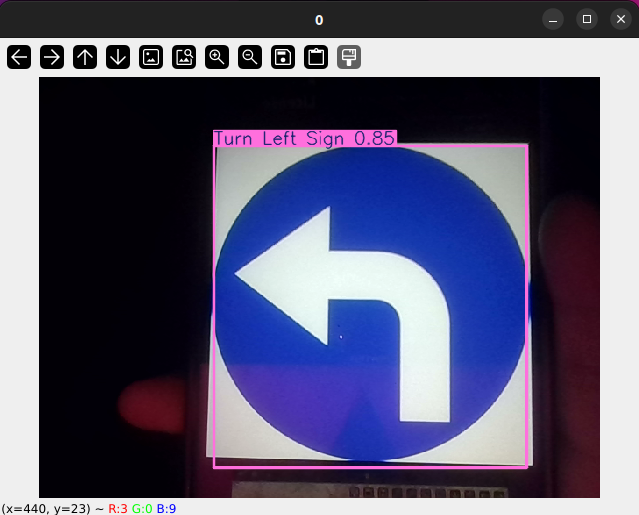
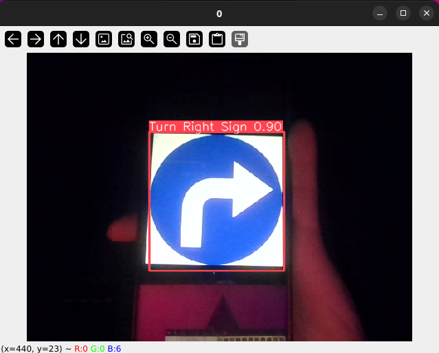

# Official ADAS Software - Copyright SAM-FSD © NaVin AIF Technology. All Rights Reserved


## Hướng dẫn setup, tiền chuẩn bị trước khi khởi chạy hệ thống
* Đầu tiên, quý khách hàng cần download thư mục source SAM-FSD được cung cấp bởi NaVin Tech, quý khách hàng có thể download từ link Google Drive hoặc Github do công ty cung cấp
* Thực hiện giải nén file dự án
* Để chạy dự án trên thiết bị nhúng (Raspberry Pi or Jetson), quý khách hàng cần flash thẻ SD, khuyến khích nên sử dụng phiên bản mới nhất và 64-bit để có thể sử dụng và khởi chạy một cách thuận lợi và được hỗ trợ mạnh mẽ hơn từ các phiên bản mới nhất

## Tổng quan về các Folder
* [X_Benchmark](X_Benchmark): Thư mục chứa các thông tin về các tham số, kết quả đào tạo, dữ liệu
* [X_Dataset](X_Dataset): Thư mục chứa bộ dữ liệu đào tạo 6 loại biển báo
* [X_Image_Sign_Test](X_Image_Sign_Test): Thư mục chứa hình ảnh thử nghiệm quá trình nhận diện biển báo
* [X_Lane_Detect](X_Lane_Detect): Thư mục chứa hệ thống nhận diện Lane
* [X_Logo](X_Logo): Thư mục chứa logo 
* [X_Model](X_Model): Thư mục chứa các model biển báo được đào tạo
* [X_Results](X_Results): Thư mục chứa kết quả trong quá trình xử lý thời gian thực
* [X_Traffic_Sign](X_Traffic_Sign): Thư mục chứa hệ thống nhận diện biển báo và điều khiển các chân I/O Raspberry


## Setup
Hiện tại chúng tôi sử dụng Python phiên bản 3.10.12, tuy nhiên chương trình hoàn toàn hoạt động tốt trên các phiên bản từ 3.8 trở lên. Để chương trình có thể hoạt động tốt hãy mở terminal và thực hiện cài đặt các phụ thuộc mà chúng tôi yêu cầu


```bash
# Tại thư mục gốc của dự án
pip install -r requirements.txt
```

## Tổng quan về cách triển khai hoạt động, chức năng của các file

* [X_Traffic_Sign/x_sensor_obstacle.py](X_Traffic_Sign/x_sensor_obstacle.py): Chương trình nhận diện vật cản, đọc cảm biến siêu âm dùng cho quá trình đọc vật cản(Có thể tham khảo nếu cần thiết)
* [X_Traffic_Sign/x_multi_detect_pt.py](X_Traffic_Sign/x_multi_detect_pt.py): Chương trình sử dụng 2 model pt để nhận diện biển báo và vật cản xe hơi, đã khai báo các chân GPIO, tuy nhiên do chạy model song song pt, hiệu năng chương trình sẽ có sự khác biệt so với việc chạy một model
* [X_Traffic_Sign/x_multi_detect_onnx.py](X_Traffic_Sign/x_multi_detect_onnx.py): Chương trình sử dụng 2 model onnx để nhận diện biển báo và vật cản xe hơi, đã khai báo các chân GPIO, tuy nhiên do chạy model song song onnx, chất lượng hiệu năng xử lý sẽ tốt hơn model dạng pt, hiệu năng chương trình vẫn sẽ có sự khác biệt so với việc chạy một model, nhưng sự ảnh hưởng là không nhiều
* [X_Traffic_Sign/x_detect_pt_rasp.py](X_Traffic_Sign/x_detect_pt_rasp.py): Chương trình đơn sử dụng duy nhất một model nhận diện biển báo để chạy chương trình, hiệu năng xử lý sẽ tốt và nhanh hơn, và chương trình đã được khai báo để sử dụng và bật các chân GPIO khi nhận diện được biển báo
 * [X_Traffic_Sign/x_detect_pt_com.py](X_Traffic_Sign/x_detect_pt_com.py): Chương trình đơn sử dụng duy nhất một model nhận diện biển báo để chạy chương trình, hiệu năng xử lý sẽ tốt và nhanh hơn, chương trình chưa khai báo các chân GPIO, có thể được dùng để test trên cả máy tính window và máy Raspberry
* [X_Traffic_Sign/x_detect_onnx_rasp.py](X_Traffic_Sign/x_detect_onnx_rasp.py) và [X_Traffic_Sign/x_detect_pt_com.py](X_Traffic_Sign/x_detect_pt_com.py): Là hai chương trình với chức năng tương tự như bên trên nhưng nó sử dụng model ONNX sẽ có thể hoạt động với hiệu suất tốt hơn
 * [X_Traffic_Sign/x_detect_car.py](X_Traffic_Sign/x_detect_car.py): Chương trình đơn nhận diện vật cản xe, đã được khai báo bật các chân GPIO khi nhận diện được xe
 

## Usage
Hãy làm theo các chỉ dẫn để chạy chương trình
```bash
# Trước tiên thư mục bạn cần đứng tại thư mục gốc của chương trình để khởi chạy chính xác
# Ví dụ thư mục đứng tại terminal hiện tại của công ty là:
# navin@navin-admin:~/Official_ADAS_Software_NaVin_Beta_0.1.0$ 
# Sau đó chạy lệnh này để thực hiện cài đặt tất cả các phụ thuộc cần thiết để chạy chương trình
pip install -r requirements.txt

# Để chạy chương trình nhận diện lane
python3 X_Lane_Detect/x_lane_detect_oop.py

# Để chạy chương trình nhận diện đơn trên máy tính thông thường, 6 loại biển báo, cấu trúc pt
python3 X_Traffic_Sign/x_detect_pt_com.py

# Để chạy chương trình nhận diện đơn trên máy tính thông thường, 6 loại biển báo, cấu trúc onnx
python3 X_Traffic_Sign/x_detect_onnx_com.py

# Để chạy chương trình nhận diện đơn trên máy tính Raspberry đã khai báo kích các chân GPIO, 6 loại biển báo, cấu trúc pt
python3 X_Traffic_Sign/x_detect_pt_rasp.py

# Để chạy chương trình nhận diện đơn trên máy tính Raspberry đã khai báo kích các chân GPIO, 6 loại biển báo, cấu trúc onnx
python3 X_Traffic_Sign/x_detect_onnx_rasp.py

# Để chạy chương trình nhận diện đơn trên máy tính Raspberry đã khai báo kích các chân GPIO, vật cản xe, cấu trúc pt
python3 X_Traffic_Sign/x_detect_car.py

# Để chạy chương trình nhận diện song song trên máy tính Raspberry đã khai báo kích các chân GPIO, vật cản xe và 6 loại biển báo, cấu trúc pt
python3 X_Traffic_Sign/x_multi_detect_pt.py

# Để chạy chương trình nhận diện song song trên máy tính Raspberry đã khai báo kích các chân GPIO, vật cản xe và 6 loại biển báo, cấu trúc onnx
python3 X_Traffic_Sign/x_multi_detect_onnx.py

# Để chạy chương trình nhận diện cảm biến máy tính Raspberry đã khai báo kích các chân GPIO, vật cản xe, bạn trước tiên cần phải khai báo các chân cắm và dữ liệu trước tiên để thực hiện đúng và chương trình hoạt động
python3 X_Traffic_Sign/x_sensor_obstacle.py
```

## Demo










# Giấy phép

[MIT License](https://opensource.org/licenses/MIT).

All copyrights belong to [NaVin AIF Technology](https://youtube.com/@navin_aif_tech?si=weCtRn8YjGdgIVZk). Contact us for more details.

Copyright SAM-FSD © 2024 [NaVin AIF Technology](https://youtube.com/@navin_aif_tech?si=weCtRn8YjGdgIVZk). All Rights Reserved
